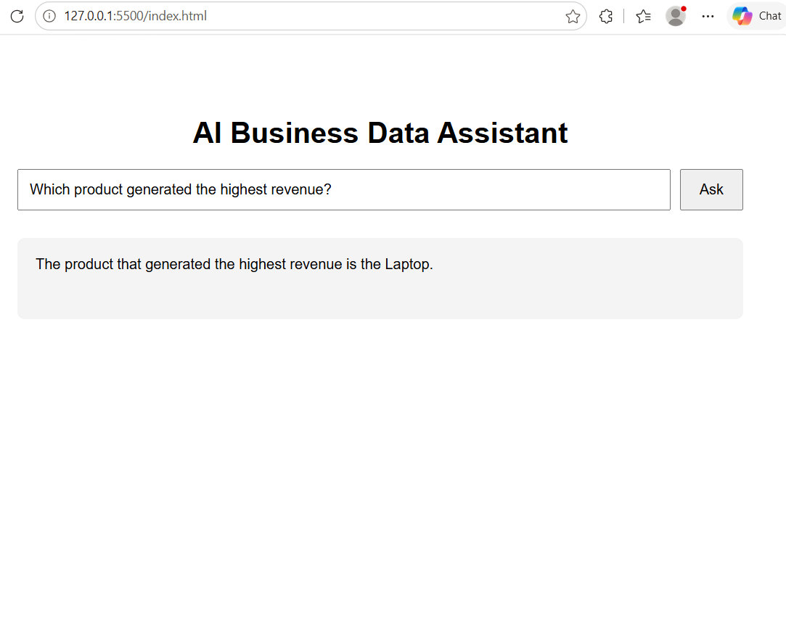
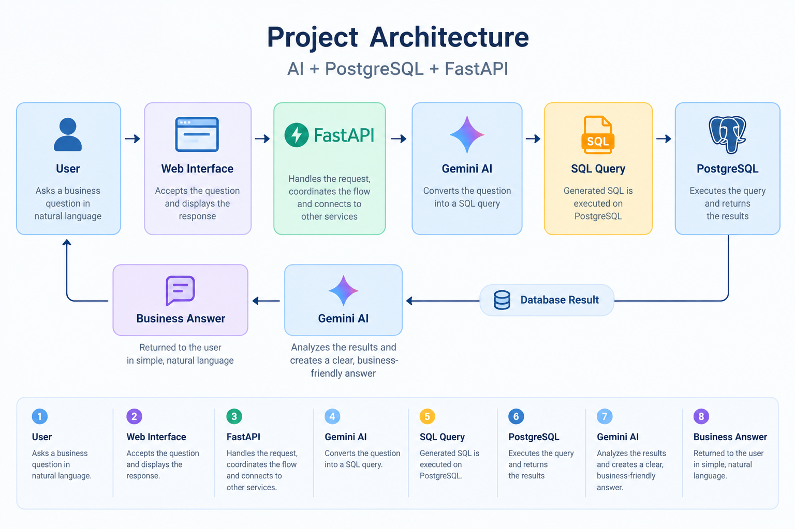

# AI Business Data Assistant

An AI-powered business data assistant that allows users to ask business questions in natural language and receive answers from a PostgreSQL database.

The application uses Gemini to convert natural-language questions into SQL queries, executes those queries on PostgreSQL, and then converts the database results into clear business-friendly answers.

## 🖥️ Demo

The application allows users to ask business questions in natural language and receive answers from the PostgreSQL database through an AI-powered interface.



**Example:**

> **Question:** Which product generated the highest revenue?

> **Answer:** The product that generated the highest revenue is the Laptop.

## 🚀 Features

* Ask business questions using natural language
* Automatically generate PostgreSQL queries using Gemini
* Execute queries on a PostgreSQL sales database
* Restrict AI-generated queries to read-only `SELECT` operations
* Convert database results into simple business answers
* FastAPI backend for API communication
* Simple web-based frontend
* Indian Rupee (₹) formatting for monetary results

## 🛠️ Tech Stack

* **Python**
* **PostgreSQL**
* **Gemini API**
* **FastAPI**
* **Psycopg2**
* **HTML / CSS / JavaScript**
* **Git & GitHub**

## 🏗️ How It Works

The system follows this architecture:



### Workflow

1. **User** asks a business question through the web interface.
2. **FastAPI** receives the request.
3. **Gemini AI** converts the natural-language question into a SQL query.
4. **PostgreSQL** executes the generated read-only query.
5. The **database result** is returned to Gemini AI.
6. **Gemini AI** converts the result into a clear, business-friendly answer.
7. The answer is displayed to the **User**.

## ⚙️ Setup & Installation

### 1. Clone the repository

```bash
git clone https://github.com/krishnac0853507-cpu/ai-business-data-assistant.git
cd ai-business-data-assistant
```

### 2. Create a virtual environment

```bash
python -m venv venv
```

### 3. Install dependencies

```bash
pip install -r requirements.txt
```

### 4. Configure environment variables

Create a `.env` file and add your Gemini API key:

```env
GEMINI_API_KEY=your_api_key_here
```

Do not upload your actual API key to GitHub.

### 5. Set up PostgreSQL

Use the SQL script provided in:

```text
ai project.sql
```

Configure your PostgreSQL database connection as required by the project.

### 6. Run the application

On Windows PowerShell:

```powershell
.\venv\Scripts\python.exe -m uvicorn main:app --reload
```

Then open the application in your browser.


